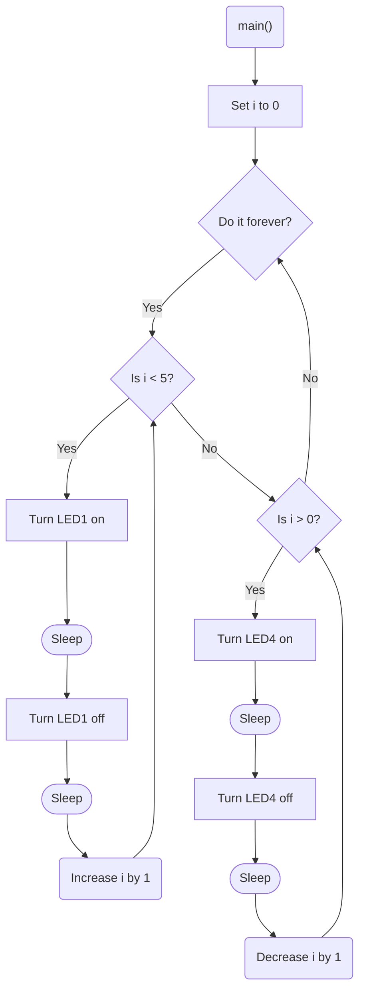

# Program: Two Hearts
**Author(s):**
**Date:**

**Modified by:**  
**Date:**

**Purpose:** This program flashes two of the internal LEDs on the nRF52840 DK. One flashes five times and then the other flashes 5 times. The cycle repeats forever.

## Configuration
Uses default devicetree configuration

## Hardware
### Internal
* LED1 (digital output)
* LED2 (digital output)

## Flow
